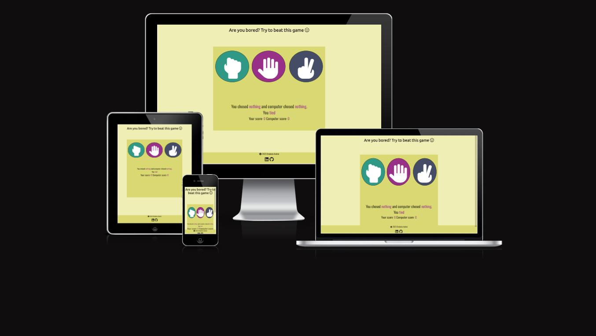
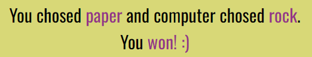
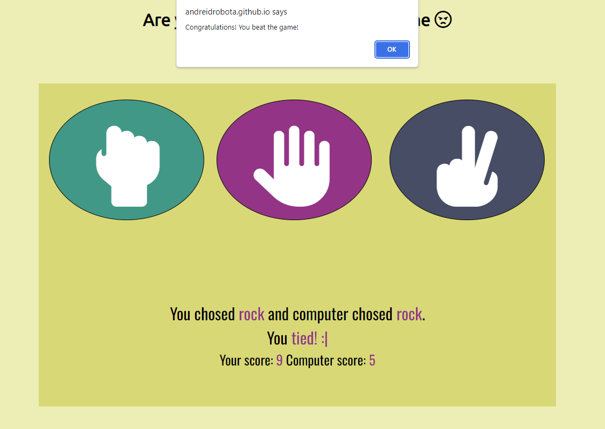

# Rock Paper Scissors minigame

Rock Paper Scissors is a minigame that aims to be part of a website page, in order to eliminate the boredom for the user, and create a competition.

## Features

### Existing Features

- __The Game Area__
   - This section will allow the user to play the game. Users will be able to easily see the icons and diferentiate them because of the colors, and can either chose rock, paper, scissors.
 
- __The choices area__
   - This section allows the user to see what his choice is, and aswell generate the computer choice.
   - The "battle" result will be displayed aswell with one emoji for every situation.
  
- __The score area__
   - This section will automatically keep the score either it's win for the user either for the computer.
   - When one of the 2 scores reaches 10, it will alert a message either for winning or losing.
   - The score will be automatically restored to 0 for both sides.
  

### Features left to implement

- Adding the number of, out of 10 games won.
- Adding after a number of games out of ten won, creating a special gift code for the user to use for the site.

## Testing

### Validator Testing

- HTML 
  - No errors were returned when passing through the Official [W3C validator](https://validator.w3.org/nu/?doc=https%3A%2F%2Fandreidrobota.github.io%2Flittle-minigame%2F)
- CSS
  - No errors were found when passing through the Official [(Jigsaw) validator] (<https://jigsaw.w3.org/css-validator/validator?uri=https%3A%2F%2Fandreidrobota.github.io%2Flittle-minigame%2F&profile=css3svg&usermedium=all&warning=1&vextwarning=&lang=en>)
- JavaScript
  - No errors were found when passing through the Official [Jshint validator](https://jshint.com/)
  - The following metrics were returned:
  - There are 12 functions in this file.
  - Function with the largest signature take 2 arguments, while the median is 0.
  - Largest function has 11 statements in it, while the median is 3.
  - The most complex function has a cyclomatic complexity value of 8 while the median is 1.

### Unfixed Bugs

There are no existing bugs that the developer knows about, after testing in HTML, CSS and JavaScript validators.

## Deployment 

- The site was deployed to GitHub pages. Steps:
   - In the GitHub repository, go to settings
   - From the source section, select main branch
   - When the branch is selected, the page will be automatically createe and display after 1-2 minutes

The live link here - <https://andreidrobota.github.io/little-minigame/>

## Credits

- The icons in the footer and game area were taken from [Font awesome](https://fontawesome.com/)
- Some extra help debugging functions via Chrome Dev Tools.